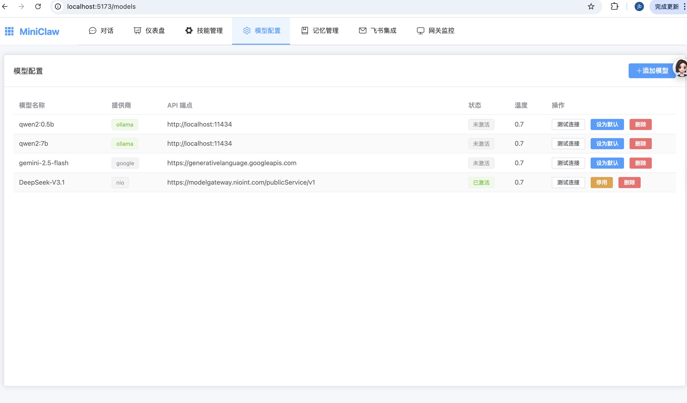
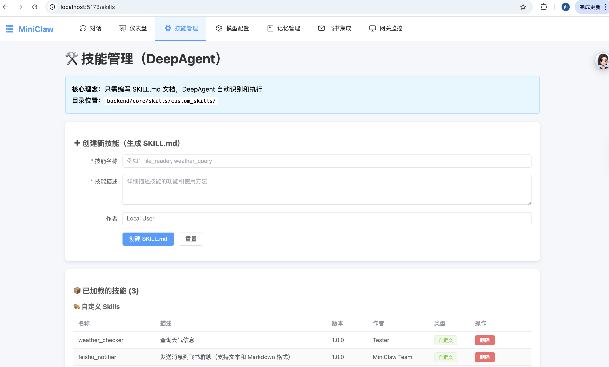
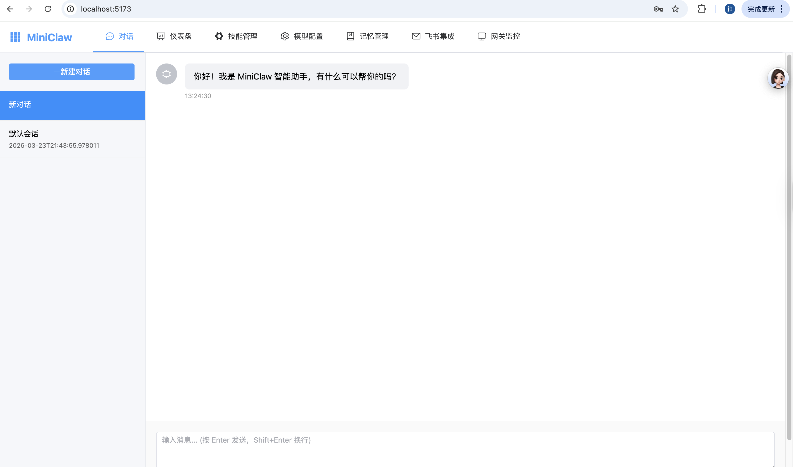

# MiniClaw 🐾

**轻量化 LangChain DeepAgents 智能体网关 - 本地个人版**

> 基于 LangChain DeepAgents 原生 Skills 机制，为零基础用户设计的轻量级 AI 助手

> **✨ 本地模式无需登录，开箱即用！**

---

## 🚀 快速开始

### 1. 环境要求

- Python 3.11+
- Node.js 18+
- Conda（推荐）

### 2. 后端启动

```bash
cd backend
conda activate MiniClaw  # 或 source venv/bin/activate
pip install -r requirements.txt
python main.py
```

后端将在 `http://localhost:8000` 启动

### 3. 前端启动（新终端）

```bash
cd frontend
npm install
npm run dev
```

前端将在 `http://localhost:5173` 启动

---

## ✨ 核心功能

### 1. **智能对话** 💬

- 基于 LangChain DeepAgents
- 自动调用 Skills
- 多轮对话支持
- 上下文记忆

### 2. **Skills 技能系统** 🛠️

**极简开发**：只需编写 `SKILL.md` 文档，DeepAgent 自动识别和执行

示例目录结构：
```
backend/core/skills/custom_skills/
├── file_reader/
│   └── SKILL.md          # 文件读取技能
├── feishu_notifier/
│   └── SKILL.md          # 飞书通知技能
└── your_skill/
    └── SKILL.md          # 你的技能
```

创建技能：
1. 访问 `http://localhost:5173/skills`
2. 填写表单（名称、描述）
3. 自动生成 SKILL.md
4. 重启后端服务

使用技能：
- 直接在聊天中说："帮我读取 example.txt 文件"
- DeepAgent 自动调用 `file_reader` 技能

### 3. **模型配置** 🤖

支持多种模型：
- Anthropic Claude（默认）
- Google Gemini
- Ollama（本地模型）

---

## 📁 项目结构

```
MiniClaw/
├── backend/
│   ├── core/
│   │   ├── skills/              # Skills 系统
│   │   │   ├── __init__.py      # DeepAgents 集成
│   │   │   └── custom_skills/   # 自定义技能
│   │   ├── agent/               # Agent 配置
│   │   └── memory/              # 记忆管理
│   ├── api/v1/
│   │   ├── chat.py              # 对话接口
│   │   ├── skills.py            # 技能管理
│   │   └── models.py            # 模型配置
│   ├── main.py                  # 服务入口
│   └── requirements.txt         # Python 依赖
├── frontend/
│   ├── src/
│   │   ├── pages/               # 页面组件
│   │   ├── api/                 # API 封装
│   │   └── store/               # 状态管理
│   └── package.json             # Node 依赖
└── docs/                        # 文档
```

---

## 🔧 配置说明

编辑 `backend/.env` 文件：

```env
# 模型配置
DEFAULT_MODEL=claude-sonnet-4-5
ANTHROPIC_API_KEY=sk-ant-xxx

# 服务配置
HOST=0.0.0.0
PORT=8000
DEBUG=true

# 日志配置
LOG_LEVEL=INFO
```

---

## 📖 文档

- [快速开始指南](QUICKSTART.md)
- [Skills 开发指南](docs/SKILLS_SIMPLE.md)
- [部署指南](docs/deployment.md)
- [开发指南](docs/development.md)

---

## 🎯 特性对比

| 特性 | MiniClaw 本地版 | OpenClaw 企业版 |
|------|--------------|---------------|
| 用户认证 | ❌ 无需登录 | ✅ RBAC 权限 |
| Skills 开发 | ✅ SKILL.md | ✅ 完整 SDK |
| 分布式 | ❌ 单机 | ✅ 多节点 |
| 适用场景 | 个人使用 | 企业生产 |

---

## 🤝 贡献

欢迎提交 Issue 和 Pull Request！

---

## 📄 许可证

MIT License

---

**🎉 享受你的个人 AI 助手！**

## 🤝 界面






